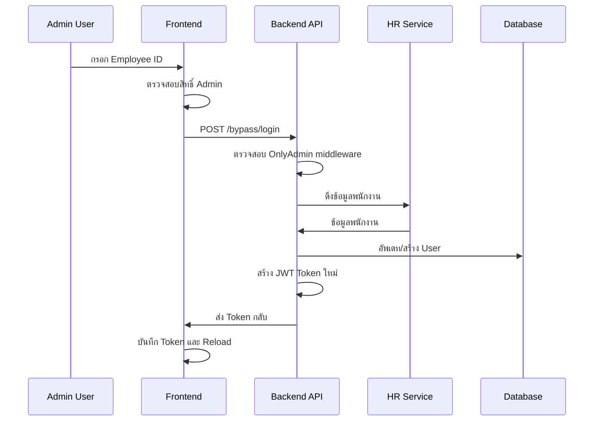

# Bypass Login Implementation Guide

## Overview
Bypass Login เป็น feature ที่ช่วยให้ผู้ดูแลระบบ (Admin) สามารถสวมสิทธิ์เป็นผู้ใช้คนอื่นได้ โดยไม่ต้องใช้รหัสผ่านของผู้ใช้นั้น ๆ ซึ่งมีประโยชน์ในการ debug, testing, หรือช่วยเหลือผู้ใช้งาน

## Prerequisites
- ผู้ใช้ต้อง login ผ่าน Keycloak SSO แล้ว
- ผู้ใช้ต้องมี role เป็น "admin"
- ระบบต้องมี HR Service สำหรับดึงข้อมูลพนักงาน
- ตรวจสอบ **TECHNOLOGY STACK** ก่อนดำเนินการด้วย (ตัวอย่างนี้ Frontend: NextJS, Backend: Go-Echo)

## Architecture Overview



## Backend Implementation

### 1. Model Definition

#### `/internal/model/user.go`
```go
package model

import (
    "opa/internal/constant"
    "time"
)

// BypassRequest struct สำหรับรับ request จาก frontend
type BypassRequest struct {
    EmployeeID string `json:"employee_id" binding:"required"`
}

// User struct หลักของระบบ
type User struct {
    EmployeeID  string
    Role        constant.Role
    IsActive    bool
    Permissions []string
}

// UserResponse struct สำหรับ response กลับไป frontend
type UserResponse struct {
    EmployeeID string        `json:"employee_id"`
    IsActive   bool          `json:"is_active"`
    Role       constant.Role `json:"role"`
}

func (model *User) ToResponse() *UserResponse {
    return &UserResponse{
        EmployeeID: model.EmployeeID,
        IsActive:   model.IsActive,
        Role:       model.Role,
    }
}
```

### 2. Middleware Security

#### `/internal/middlewares/onlyAdmin.go`
```go
package middlewares

import (
    "net/http"
    "opa/internal/logger"
    "opa/internal/model"
    "opa/internal/policy"
    "opa/internal/response"
    "github.com/labstack/echo/v4"
)

// OnlyAdmin middleware ป้องกันการเข้าถึงเฉพาะ admin เท่านั้น
func OnlyAdmin(next echo.HandlerFunc) echo.HandlerFunc {
    return func(ctx echo.Context) error {
        log := logger.Unwrap(ctx)
        user := ctx.Get("user").(model.User)
        policy := policy.NewCandidatePolicy(user)
        
        if !policy.IsAdmin() {
            log.Error("this route access only admin")
            return ctx.JSON(http.StatusForbidden, response.ResponseError{
                Error: "this route access only admin",
            })
        }
        return next(ctx)
    }
}
```

### 3. JWT Token Utilities

#### `/internal/utils/auth.go`
```go
package utils

import (
    "fmt"
    "log"
    "net/http"
    "opa/internal/config"
    "opa/internal/constant"
    "opa/internal/model"
    "time"
    "github.com/golang-jwt/jwt/v5"
)

type Claims struct {
    EmployeeID string        `json:"employee_id"`
    Role       constant.Role `json:"role"`
    jwt.RegisteredClaims
}

// CreateToken สร้าง JWT token สำหรับผู้ใช้
func CreateToken(user model.User, duration time.Duration) (string, error) {
    t := jwt.NewWithClaims(jwt.SigningMethodHS256, Claims{
        user.EmployeeID,
        user.Role,
        jwt.RegisteredClaims{
            ExpiresAt: jwt.NewNumericDate(time.Now().Add(duration * time.Hour)),
            IssuedAt:  jwt.NewNumericDate(time.Now()),
            NotBefore: jwt.NewNumericDate(time.Now()),
            Issuer:    config.FrontendURL,
            Subject:   user.EmployeeID,
            ID:        user.EmployeeID,
            Audience:  jwt.ClaimStrings{user.EmployeeID},
        },
    })

    signedToken, err := t.SignedString([]byte(config.AuthJWTSecret))
    if err != nil {
        log.Fatal("error signing key")
        return signedToken, err
    }

    return signedToken, nil
}

// VerifyToken ตรวจสอบความถูกต้องของ JWT token
func VerifyToken(tokenString string) (*Claims, error) {
    token, err := jwt.ParseWithClaims(tokenString, &Claims{}, func(token *jwt.Token) (interface{}, error) {
        if _, ok := token.Method.(*jwt.SigningMethodHMAC); !ok {
            return nil, fmt.Errorf("unexpected signing method: %v", token.Header["alg"])
        }
        return []byte(config.AuthJWTSecret), nil
    })

    if err != nil {
        return nil, err
    }

    claims, ok := token.Claims.(*Claims)
    if !ok {
        return nil, fmt.Errorf("verify token error")
    }
    return claims, nil
}
```

### 4. Controller Implementation

#### `/internal/user/controller.go`
```go
package user

import (
    "net/http"
    "opa/internal/config"
    "opa/internal/logger"
    "opa/internal/model"
    "opa/internal/response"
    "opa/internal/utils"
    "github.com/labstack/echo/v4"
    "gorm.io/gorm"
)

type Controller struct {
    Service Service
}

// BypassLogin godoc
// @Summary Bypass login for development
// @Description Login as another user (for development purposes)
// @Tags Admin
// @Accept json
// @Produce json
// @Param user body model.BypassRequest true "User Employee ID"
// @Success 200 {object} map[string]interface{} "Returns authentication details with token"
// @Failure 400 {object} response.ResponseError "Invalid request"
// @Failure 404 {object} response.ResponseError "User not found"
// @Router /bypass/login [post]
func (c *Controller) BypassLogin(ctx echo.Context) error {
    log := logger.Unwrap(ctx)

    // ดึงข้อมูลผู้ใช้ที่ทำการ bypass (admin)
    createdBy := ctx.Get("user").(model.User).EmployeeID

    // รับข้อมูล request
    u := new(model.BypassRequest)
    if err := ctx.Bind(u); err != nil {
        log.Error(err.Error())
        return ctx.JSON(http.StatusBadRequest, response.ResponseError{
            Error: "Invalid request format",
        })
    }

    // ตรวจสอบความถูกต้องของ Employee ID
    if len(u.EmployeeID) != 6 {
        return ctx.JSON(http.StatusBadRequest, response.ResponseError{
            Error: "Employee ID must be 6 digits",
        })
    }

    // ดึงข้อมูลพนักงานจาก HR Service
    employee, err := c.Service.EmployeeService.GetByEmployeeID(u.EmployeeID)
    if err != nil {
        log.Error(err.Error())
        return ctx.JSON(http.StatusNotFound, response.ResponseError{
            Error: "Employee not found in HR Service",
        })
    }

    // แปลงข้อมูล Employee เป็น User
    user := employee.ToUser()

    // อัพเดทหรือสร้าง User ในฐานข้อมูล
    updatedUser, err := c.Service.Repository.UpdateOrCreateUser(user, createdBy)
    if err != nil {
        log.Error(err.Error())
        return ctx.JSON(http.StatusInternalServerError, response.ResponseError{
            Error: "Failed to update or create user",
        })
    }

    // สร้าง JWT Token ใหม่
    token, err := utils.CreateToken(updatedUser, config.AuthJWTExpiredDuration)
    if err != nil {
        log.Error(err.Error())
        return ctx.JSON(http.StatusInternalServerError, response.ResponseError{
            Error: "Failed to create token",
        })
    }

    // ส่ง response กลับ
    return ctx.JSON(http.StatusOK, map[string]interface{}{
        "isAuthenticated": true,
        "token":           token,
        "user":            updatedUser.ToResponse(),
        "employee":        employee.ToResponse(),
    })
}
```

### 5. Route Configuration

#### `/cmd/opa-api/server.go`
```go
func setupRoutes(e *echo.Echo, db *gorm.DB) {
    // ... other routes ...

    // Protected API routes
    protectedAPI := e.Group("/api/v1")
    protectedAPI.Use(middlewares.AuthMiddleware)

    // Admin routes
    adminAPI := protectedAPI.Group("/admin")
    adminAPI.Use(middlewares.OnlyAdmin)
    {
        adminAPI.GET("/users/:employeeID", uc.GetUserByEmployeeID)
        adminAPI.GET("/employees/:employeeID", uc.GetEmployeeByEmployeeID)
    }

    // Bypass Login Route - ใช้ OnlyAdmin middleware
    protectedAPI.POST("/bypass/login", uc.BypassLogin, middlewares.OnlyAdmin)
}
```

## Frontend Implementation

### 1. Axios Configuration

#### `/config/axios.config.ts`
```typescript
import { apiV1Url } from "@/services";
import axios from "axios";
import Cookies from "js-cookie";

const baseURL = apiV1Url;

export const api = axios.create({
  baseURL,
  timeout: 60000, // 60 seconds timeout
});

// Request interceptor: แนบ token อัตโนมัติ
api.interceptors.request.use(
  (config) => {
    const token = Cookies.get("token");
    if (token) {
      config.headers.Authorization = `Bearer ${token}`;
    }
    return config;
  },
  (error) => Promise.reject(error)
);

// Response interceptor: จัดการ error
api.interceptors.response.use(
  (response) => response,
  (error) => {
    if (error.response?.status === 401) {
      // Token หมดอายุ - redirect to login
      Cookies.remove("token", { path: "/" });
      window.location.href = "/login";
    }
    return Promise.reject(error);
  }
);
```

### 2. Bypass Login Component

#### `/components/bypassLogin.tsx`
```tsx
"use client";

import { api } from "@/config/axios.config";
import { useAuth } from "@/provider/auth.provider";
import Cookies from "js-cookie";
import { useState } from "react";

interface BypassResponse {
  isAuthenticated: boolean;
  token: string;
  user: {
    employee_id: string;
    role: string;
    is_active: boolean;
  };
  employee: {
    employee_id: string;
    full_name_th: string;
    email: string;
    position: string;
    department: string;
  };
}

export default function BypassLogin() {
  const { user } = useAuth();
  const [loading, setLoading] = useState(false);
  const [error, setError] = useState<string>("");

  const handleSubmit = async (event: React.FormEvent<HTMLFormElement>) => {
    event.preventDefault();
    setLoading(true);
    setError("");

    const formData = new FormData(event.currentTarget);
    const employeeId = formData.get("employeeID") as string;

    // ตรวจสอบข้อมูลพื้นฐาน
    if (!employeeId) {
      setError("กรุณากรอกรหัสพนักงาน");
      setLoading(false);
      return;
    }

    if (employeeId.length !== 6) {
      setError("รหัสพนักงานต้องเป็น 6 หลัก");
      setLoading(false);
      return;
    }

    if (user.employee_id === employeeId) {
      setError("ไม่สามารถ bypass ตัวเองได้");
      setLoading(false);
      return;
    }

    try {
      const { data } = await api.post<BypassResponse>("/bypass/login", {
        employee_id: employeeId,
      });

      if (data.token) {
        // บันทึก token ใหม่
        Cookies.set("token", data.token, { 
          path: "/",
          expires: 7 // 7 days
        });

        // แสดงข้อความสำเร็จ
        alert(`Bypass สำเร็จ! กำลังเข้าสู่ระบบในฐานะ: ${data.employee.full_name_th}`);

        // Reload page เพื่อใช้ token ใหม่
        location.reload();
      }
    } catch (error: any) {
      console.error("Bypass Error:", error);
      
      if (error.response?.status === 403) {
        setError("คุณไม่มีสิทธิ์ใช้งาน Bypass");
      } else if (error.response?.status === 404) {
        setError("ไม่พบข้อมูลพนักงานในระบบ");
      } else {
        setError(error.response?.data?.error || "เกิดข้อผิดพลาดในการ Bypass");
      }
    } finally {
      setLoading(false);
    }
  };

  // แสดงเฉพาะ admin เท่านั้น
  if (user.role !== "admin") {
    return null;
  }

  return (
    <div className="bg-white p-6 rounded-lg shadow-md max-w-md mx-auto">
      <h3 className="text-lg font-semibold mb-4 text-gray-800">
        🔄 Bypass Login (Admin Only)
      </h3>
      
      <form onSubmit={handleSubmit} className="space-y-4">
        <div>
          <label 
            htmlFor="employeeID" 
            className="block text-sm font-medium text-gray-700 mb-2"
          >
            รหัสพนักงานที่ต้องการ Bypass:
          </label>
          
          <input
            type="text"
            id="employeeID"
            name="employeeID"
            className="w-full border-2 border-gray-300 rounded-md p-3 focus:border-blue-500 focus:outline-none"
            placeholder="กรอกรหัสพนักงาน 6 หลัก"
            maxLength={6}
            pattern="[0-9]{6}"
            disabled={loading}
          />
        </div>

        {error && (
          <div className="text-red-600 text-sm bg-red-50 p-2 rounded">
            ❌ {error}
          </div>
        )}

        <div className="flex gap-2">
          <button 
            type="submit"
            disabled={loading}
            className={`flex-1 px-4 py-2 rounded-md text-white font-medium
              ${loading 
                ? 'bg-gray-400 cursor-not-allowed' 
                : 'bg-blue-500 hover:bg-blue-600 active:bg-blue-700'
              }`}
          >
            {loading ? "⏳ กำลังประมวลผล..." : "🚀 Bypass Login"}
          </button>
          
          <button 
            type="button"
            onClick={() => {
              const form = document.querySelector('form') as HTMLFormElement;
              form.reset();
              setError("");
            }}
            disabled={loading}
            className="px-4 py-2 border border-gray-300 rounded-md text-gray-700 hover:bg-gray-50"
          >
            ❌ Clear
          </button>
        </div>
      </form>

      <div className="mt-4 text-xs text-gray-500 bg-gray-50 p-3 rounded">
        <p><strong>ข้อมูลปัจจุบัน:</strong></p>
        <p>👤 รหัสพนักงาน: {user.employee_id}</p>
        <p>🔑 บทบาท: {user.role}</p>
      </div>
    </div>
  );
}
```

### 3. Auth Provider Integration

#### `/provider/auth.provider.tsx`
```tsx
"use client";

import React, { createContext, useContext, useEffect, useState, useCallback } from "react";
import Cookies from "js-cookie";
import { apiV1CurrentUser, ssoLogoutUrl } from "@/services";
import { api } from "@/config/axios.config";
import { EmployeeDetail, Me, User } from "@/model";

type AuthContextType = {
  logout: () => void;
  employee: EmployeeDetail | null;
  isAuthenticated: boolean;
  refetchUser: () => void;
  user: User;
};

const AuthContext = createContext<AuthContextType>({
  logout: () => {},
  employee: null,
  isAuthenticated: false,
  refetchUser: () => {},
  user: {} as User,
});

export const AuthProvider = ({ children }: { children: React.ReactNode }) => {
  const [employee, setEmployee] = useState<EmployeeDetail | null>(null);
  const [isAuthenticated, setIsAuthenticated] = useState(false);
  const [user, setUser] = useState({} as User);
  const [reloadTrigger, setReloadTrigger] = useState(0);

  const getUser = useCallback(async () => {
    try {
      const res = await api.get<Me>(apiV1CurrentUser);
      setEmployee(res.data.employee);
      setIsAuthenticated(res.data.isAuthenticated);
      setUser(res.data.user);
    } catch (error) {
      console.error("❌ Error fetching user:", error);
      setEmployee(null);
      setIsAuthenticated(false);
      // ไม่ clear token ทันทีเพื่อให้ interceptor จัดการ
    }
  }, []);

  useEffect(() => {
    if (!employee && Cookies.get("token")) {
      getUser();
    }
  }, [getUser, reloadTrigger]);

  const refetchUser = () => setReloadTrigger(prev => prev + 1);

  const logout = () => {
    Cookies.remove("token", { path: "/" });
    window.location.href = ssoLogoutUrl;
  };

  return (
    <AuthContext.Provider
      value={{ logout, employee, isAuthenticated, refetchUser, user }}
    >
      {children}
    </AuthContext.Provider>
  );
};

export const useAuth = () => useContext(AuthContext);
```

### 4. Page Integration Example

#### `/app/admin/page.tsx`
```tsx
import BypassLogin from "@/components/bypassLogin";
import { useAuth } from "@/provider/auth.provider";

export default function AdminPage() {
  const { user, employee } = useAuth();

  if (user.role !== "admin") {
    return (
      <div className="text-center p-8">
        <h1 className="text-2xl font-bold text-red-600">Access Denied</h1>
        <p>คุณไม่มีสิทธิ์เข้าถึงหน้านี้</p>
      </div>
    );
  }

  return (
    <div className="container mx-auto p-8">
      <h1 className="text-3xl font-bold mb-8">Admin Dashboard</h1>
      
      <div className="grid grid-cols-1 lg:grid-cols-2 gap-8">
        <div>
          <h2 className="text-xl font-semibold mb-4">User Management</h2>
          {/* Other admin features */}
        </div>
        
        <div>
          <h2 className="text-xl font-semibold mb-4">Development Tools</h2>
          <BypassLogin />
        </div>
      </div>
    </div>
  );
}
```

## API Documentation

### Bypass Login Endpoint

**Endpoint:** `POST /api/v1/bypass/login`

**Authentication:** Required (Bearer Token)

**Authorization:** Admin role only

**Request Body:**
```json
{
  "employee_id": "505291"
}
```

**Success Response (200):**
```json
{
  "isAuthenticated": true,
  "token": "eyJhbGciOiJIUzI1NiIsInR5cCI6IkpXVCJ9...",
  "user": {
    "employee_id": "505291",
    "role": "admin",
    "is_active": true
  },
  "employee": {
    "employee_id": "505291",
    "full_name_th": "นาย สมชาย ใจดี",
    "email": "somchai@pea.co.th",
    "position": "วิศวกร",
    "department": "ฝ่ายเทคโนโลยี"
  }
}
```

**Error Responses:**

**400 Bad Request:**
```json
{
  "error": "Employee ID must be 6 digits"
}
```

**403 Forbidden:**
```json
{
  "error": "this route access only admin"
}
```

**404 Not Found:**
```json
{
  "error": "Employee not found in HR Service"
}
```

## Security Considerations

### 1. Authorization
- ใช้ middleware `OnlyAdmin` ตรวจสอบสิทธิ์
- ตรวจสอบ JWT token ก่อนการเข้าถึง
- Audit logging สำหรับการ bypass

### 2. Input Validation
- ตรวจสอบรูปแบบ Employee ID (6 digits)
- Sanitize input data
- ป้องกัน SQL injection และ XSS

### 3. Token Management
- JWT token มีระยะเวลาหมดอายุ
- ใช้ HMAC-SHA256 signing
- Secure cookie configuration

### 4. Audit Trail
```go
// ในการ implement อาจเพิ่ม logging
log.Info("Bypass login performed", 
    zap.String("admin_id", createdBy),
    zap.String("target_employee_id", u.EmployeeID),
    zap.String("timestamp", time.Now().Format(time.RFC3339)),
)
```

## Testing

### 1. Unit Tests

#### Backend Controller Test
```go
func TestBypassLogin(t *testing.T) {
    // Setup test environment
    e := echo.New()
    req := httptest.NewRequest(http.MethodPost, "/bypass/login", 
        strings.NewReader(`{"employee_id":"123456"}`))
    req.Header.Set(echo.HeaderContentType, echo.MIMEApplicationJSON)
    rec := httptest.NewRecorder()
    c := e.NewContext(req, rec)
    
    // Mock user context
    c.Set("user", model.User{EmployeeID: "admin1", Role: "admin"})
    
    // Test controller
    controller := &Controller{Service: mockService}
    err := controller.BypassLogin(c)
    
    // Assertions
    assert.NoError(t, err)
    assert.Equal(t, http.StatusOK, rec.Code)
}
```

### 2. Integration Tests

#### API Test
```bash
# Test bypass login with valid admin token
curl -X POST \
  http://localhost:8080/api/v1/bypass/login \
  -H 'Authorization: Bearer <admin_token>' \
  -H 'Content-Type: application/json' \
  -d '{"employee_id":"505291"}'
```

### 3. Frontend Tests

#### Component Test
```typescript
import { render, screen, fireEvent, waitFor } from '@testing-library/react';
import BypassLogin from '@/components/bypassLogin';

test('should show bypass form for admin user', () => {
  const mockUser = { employee_id: 'admin1', role: 'admin' };
  
  render(
    <AuthProvider value={{ user: mockUser }}>
      <BypassLogin />
    </AuthProvider>
  );
  
  expect(screen.getByText('BYPASS LOGIN')).toBeInTheDocument();
});

test('should hide bypass form for non-admin user', () => {
  const mockUser = { employee_id: 'user1', role: 'user' };
  
  render(
    <AuthProvider value={{ user: mockUser }}>
      <BypassLogin />
    </AuthProvider>
  );
  
  expect(screen.queryByText('BYPASS LOGIN')).not.toBeInTheDocument();
});
```

## Deployment Considerations

### 1. Environment Variables
```bash
# Backend
AUTH_JWT_SECRET=your-super-secret-key-here
AUTH_JWT_EXPIRED_DURATION=24
FRONTEND_URL=https://your-frontend-domain.com
HR_SERVICE_URL=https://hr-api.internal.com

# Frontend
NEXT_PUBLIC_CLIENT_BACKEND_URL=https://api.your-domain.com
```

### 2. Production Security
- ใช้ HTTPS เสมอ
- ตั้งค่า CORS อย่างเหมาะสม
- Enable security headers
- Rate limiting สำหรับ bypass endpoint

### 3. Monitoring
- Log bypass activities
- Monitor สำหรับการใช้งานผิดปกติ
- Alert เมื่อมีการ bypass จำนวนมาก

## Troubleshooting

### Common Issues

1. **"this route access only admin"**
   - ตรวจสอบ role ในฐานข้อมูล
   - ตรวจสอบ JWT token

2. **"Employee not found in HR Service"**
   - ตรวจสอบการเชื่อมต่อ HR Service
   - ตรวจสอบรหัสพนักงาน

3. **Frontend ไม่แสดง Bypass form**
   - ตรวจสอบ user.role ใน AuthProvider
   - ตรวจสอบ JWT token และ user context

4. **Token ไม่ถูกบันทึก**
   - ตรวจสอบ cookie settings
   - ตรวจสอบ CORS configuration

## Conclusion

Bypass Login feature ช่วยให้การ debug และ support ผู้ใช้เป็นไปอย่างมีประสิทธิภาพ โดยมีการรักษาความปลอดภัยผ่าน:
- Authorization checking
- Input validation  
- Audit logging
- Token management

Feature นี้ควรใช้เฉพาะใน development/staging environment หรือมีการควบคุมการใช้งานอย่างเข้มงวดใน production environment
